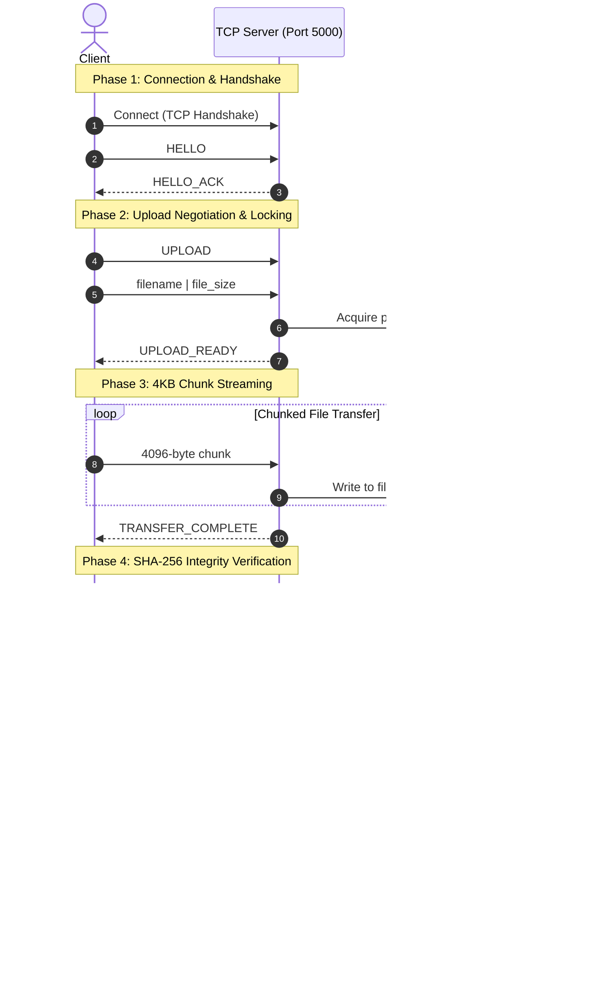

# Reliable Multi-Client File Transfer System using TCP

A robust, concurrent, multi-client file transfer system implemented in Python using native TCP sockets, featuring a custom length-prefixed binary framing protocol, per-file concurrency locking, SHA-256 integrity verification, atomic file replacement, and a professional web dashboard.

---

## Key Highlights & System Architecture

- **Custom TCP Protocol**: Length-prefixed binary framing (4-byte big-endian header `!I` + payload) over raw TCP sockets (`socket.SOCK_STREAM`).
- **Protocol Handshake**: Strict `HELLO` &rarr; `HELLO_ACK` handshake preventing connection desynchronization.
- **Concurrent Multi-Client Support**: Multi-threaded server handling concurrent connections independently via thread-per-client model.
- **Per-File Concurrency Locking**: Granular `threading.Lock` per filename ensuring serial access to a specific file without blocking transfers of other files.
- **Data Integrity Verification**: End-to-end SHA-256 checksum comparison between client and server before committing any file.
- **Atomic File Operations**: Chunks streamed to temporary files (`.tmp`), verified via checksum, and committed atomically (`os.replace`) to prevent corrupted or partial file states.
- **Automatic Stale Cleanup**: Cleanup of incomplete temporary files on disconnect or server startup.
- **Presentation-Ready Web Dashboard**: Responsive, clean management interface built with Flask, vanilla CSS, and JavaScript with live TCP socket health checks, real-time transfer stepper, search/sort filters, and audit history.

---

## Architecture & Transfer Protocol Workflow



---

## Directory Structure

```
ReliableFileTransfer/
├── client/                     # Terminal-based CLI Client
│   ├── __init__.py
│   ├── client.py               # Interactive CLI client with progress bars
│   └── downloads/              # Directory for client-downloaded files
├── database/                   # Database / persistent storage folder
├── server/                     # Core TCP Server Implementation
│   ├── __init__.py
│   ├── file_manager.py         # File validation, SHA-256 calculation, atomic ops
│   ├── logs/                   # Transfer history logs
│   │   └── transfer_history.log
│   ├── server.py               # Multi-client TCP server & per-file locks
│   ├── storage/                # Server storage directory
│   └── transfer_logger.py      # Transfer audit logging
├── shared/                     # Shared Networking & Protocol Constants
│   ├── __init__.py
│   ├── config.py               # Host, Port, Buffer, and Path settings
│   ├── network.py              # Framing, send_message, send_file, receive_file
│   └── protocol.py             # Protocol command opcodes & response tokens
├── tests/                      # Automated Verification & Test Suite
│   ├── verify_all.py           # End-to-end verification test suite
│   └── upload.txt              # Sample test file
├── web/                        # Presentation-Ready Web Dashboard
│   ├── __init__.py
│   ├── app.py                  # Flask web application & REST APIs
│   ├── downloads/              # Cache for web-downloaded files
│   ├── static/
│   │   ├── css/style.css       # Clean, modern, responsive stylesheet
│   │   └── js/dashboard.js     # Dashboard state, search/sort, upload pipeline
│   ├── tcp_client.py           # Web-to-TCP bridge client
│   ├── temp_uploads/           # Temporary staging for uploads
│   └── templates/
│       └── index.html          # Semantic HTML5 dashboard template
└── README.md
```

---

## Getting Started & Execution

### Prerequisites

- Python 3.8+ (Tested on Python 3.11)
- Python standard library dependencies (`socket`, `threading`, `hashlib`, `struct`, `os`, `time`)
- Flask (installed in the project virtual environment)

### 1. Start the TCP Backend Server

In your first terminal:

```bash
# Windows
.\venv\Scripts\python.exe -m server.server

# Linux/macOS
python -m server.server
```

*Output:*
```
==================================================
       RELIABLE FILE TRANSFER SERVER
==================================================
Server IP   : 127.0.0.1
Server Port : 5000
Status      : Running
Mode        : Multi-Client
Locking     : Per-File
Temp Cleanup: Enabled
Validation  : Enabled
Progress    : Enabled
Protocol    : Hardened
Statistics  : Enabled
Logging     : Enabled
Waiting for clients...
==================================================
```

---

### 2. Start the Web Dashboard

In your second terminal:

```bash
# Windows
.\venv\Scripts\python.exe -m web.app

# Linux/macOS
python -m web.app
```

Open your browser and navigate to:
```
http://127.0.0.1:5001
```

---

### 3. (Optional) Run the Interactive CLI Client

In your third terminal:

```bash
# Windows
.\venv\Scripts\python.exe -m client.client

# Linux/macOS
python -m client.client
```

Menu options:
1. **List Files** &mdash; Queries server file repository.
2. **Upload File** &mdash; Validates file, calculates SHA-256, streams 4KB chunks, and verifies integrity.
3. **Download File** &mdash; Receives chunks to `.tmp`, verifies hash, and commits to `client/downloads/`.
4. **Delete File** &mdash; Acquires per-file lock and removes file.
5. **Exit** &mdash; Sends `EXIT` protocol command and disconnects cleanly.

---

## Automated Verification

To run the complete automated test suite (verifying TCP handshake, multi-client concurrency, upload, download, delete, SHA-256 check, and web REST APIs):

```bash
.\venv\Scripts\python.exe tests/verify_all.py
```

---

## Web REST APIs

| Endpoint | Method | Description |
| :--- | :--- | :--- |
| `/` | `GET` | Renders the web dashboard |
| `/api/status` | `GET` | Tests TCP socket connection, latency, storage stats, and transfer metrics |
| `/api/files` | `GET` | Returns list of server files with size, SHA-256 hash, and modified date |
| `/api/transfers` | `GET` | Returns real transfer history from `server/logs/transfer_history.log` |
| `/api/upload` | `POST` | Uploads file through TCP client to backend server with integrity verification |
| `/api/download/<filename>` | `GET` | Downloads file via TCP stream from server |
| `/api/delete/<filename>` | `DELETE` | Removes file via TCP server using per-file locking |